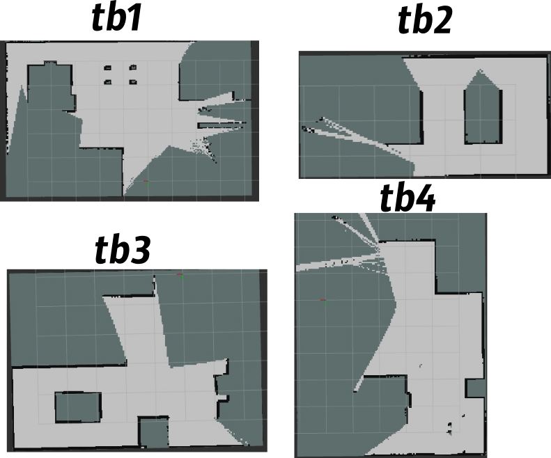
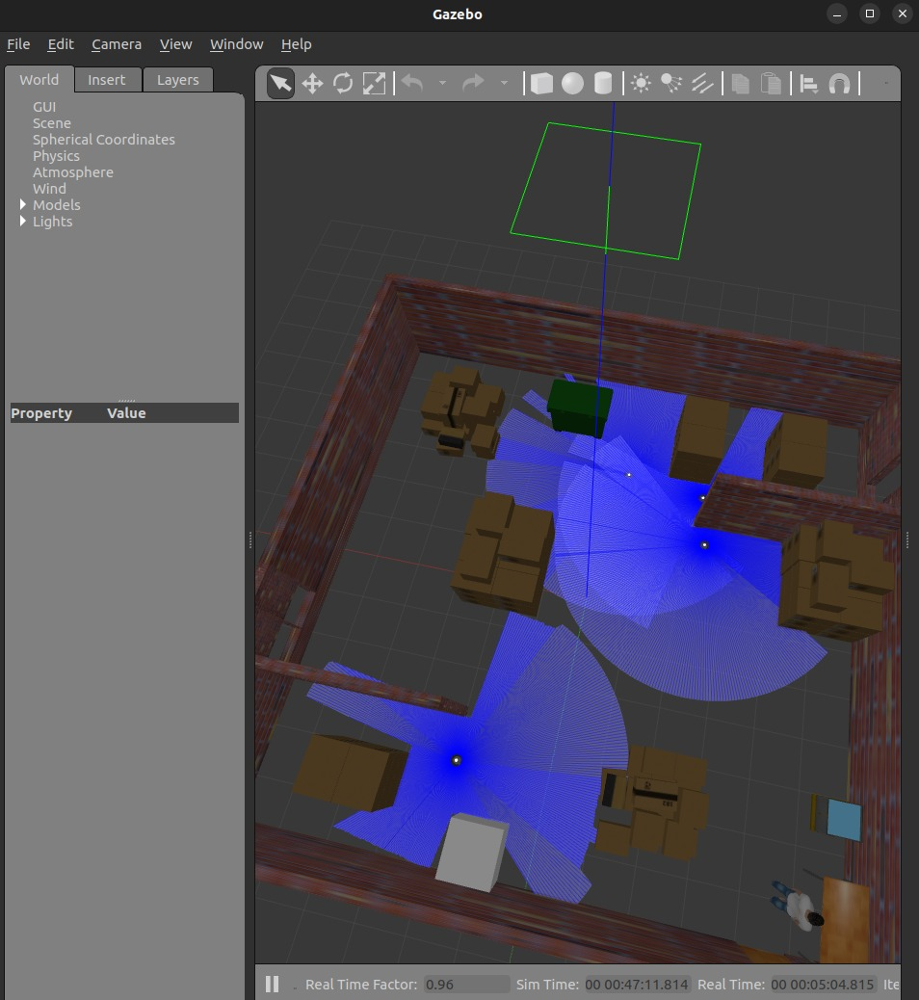
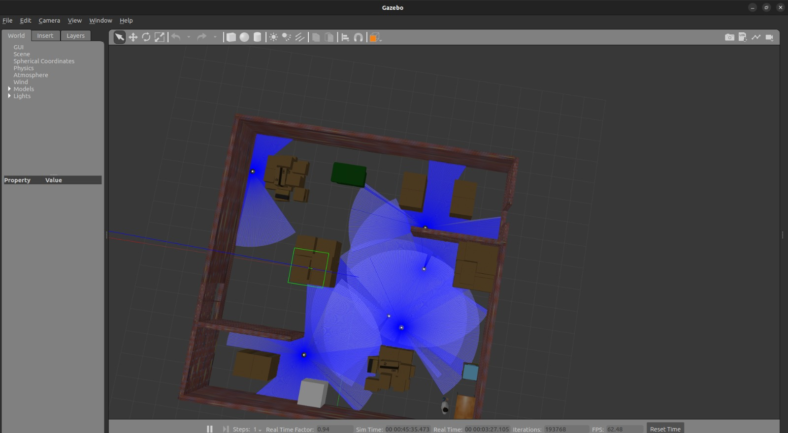
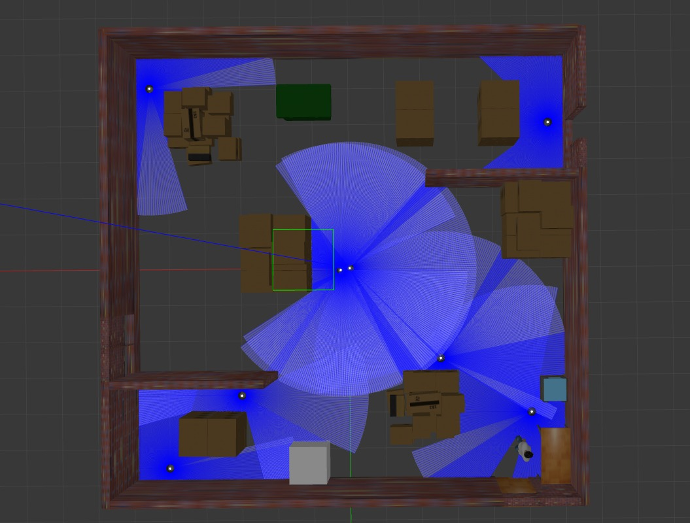

# An Autonomous exploratory swarm robotic system
This is an autonomous exploratory swarm robotic system made using ROS2 and related packages. This project was originally started as solution to Problem Statement from BharatForge in InterIIT Tech Meet - 13.0 for submission from IIT Ropar.

The project is divided into two parts
1. *Autonomous Navigation for Map Graphing -* Using multiple robots to explore an unknown map of generalized size. Thus, The system is adaptable to N number of bots and unknown areas.
2. *Task Allocation System and Navigation -* Allocating tasks to best-suited bots in the whole fleet depending on
various factors. The combination of the above tasks gives a profound system capable of complete autonomy in exploring as well as navigating any given environment.

The combination of the above tasks gives a profound system capable of complete autonomy in exploring as well as navigating any given environment.

## Folder Structure
The `src/` folder contains multiple folders-
```
src/
├── merge_map
├── multi_robot_exploration
├── path_follow
└── turtlebot3_gazebo
```

1. `turtlebot3_gazebo` - The [turtlebot3](https://github.com/ROBOTIS-GIT/turtlebot3) package for bots. 
2. `multi_robot_exploration` - Package to use frontier exploration algorithm to explore using multiple bots
3. `path_follow` - `nav2` helper for following path and optimizing the paths for multi-bot setup
4. `merge_map` - Merging RViZ maps from multiple bots into one global map


The `task_allocation/` folder contains multiple folders-
```
task_allocation/
├── add_bots.py
├── add_tasks.py
├── compute_path.py
├── navigate.py
├── navigate_to_pose.py
└── tasks.db
```
Most of the files are internal scripts-
1. `add_bots.py` - Take in number of bots in present scene and add it to database
2. `add_tasks.py` - Adding tasks to database
3. `tasks.db` - sqlite3 database

Rest of the files are used to compute the path.

## Showcase
### Images
An example of how the map merging works
<center>

</center>

Merged Map:
<center>

</center>

A demonstration of multimaps-
<center>



</center>

### Videos


## Technologies Used
- Python version: 3.10.12
- ROS 2 Humble
-   Gazebo Classic

## Setup

1. Make sure you have ros2 [setup on humble](https://docs.ros.org/en/humble/Installation.html).

2. Setup workspace
```
mkdir -p ros_ws
cd ros_ws/
```

3. Clone the repo-
```
git clone https://github.com/TrimanSingh/BharatForge
```

4. For setting up, make sure you have the required packages using-
```
git clone https://github.com/ROBOTIS-GIT/turtlebot3.git -b humble-devel
git clone https://github.com/ROBOTIS-GIT/turtlebot3_msgs.git -b humble-devel
git clone https://github.com/ROBOTIS-GIT/DynamixelSDK.git -b humble-devel
```
5. Build them using `colcon build --symlink-install` and source using `source install/setup.bash` (adjust according to shell)

6. Launch Bots and start autonomous exploration using-
```
ros2 launch turtlebot3_gazebo robots_exploration_launch.py bots:={number} x_positions:="coordinates seperated by commas" y_positions:="Same" world:={world file}
ros2 launch merge_map merge_map_launch.py bots:={number}
ros2 run multi_robot_exploration control --bots {number}
```

After exploration is complete save the merged map in `rviz` and put in map folder and rebuild the workspace
```
ros2 launch turtlebot3_gazebo robots_tasks_launch.py x_positions:="(coordinates seperated by commas)" y_positions:="Same" world:={world file}
cd task_allocation
python add_bots --bots {number}
```

Task allocation:
- Task can be assigned by python add_tasks.py {{x: 1.0, y:2.0}} or by publish point in rviz2
- Tasks are stored in `sqlite` database

For navigating-
`python navigate.py`